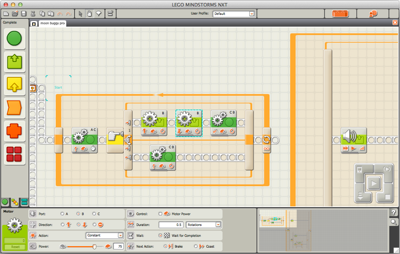
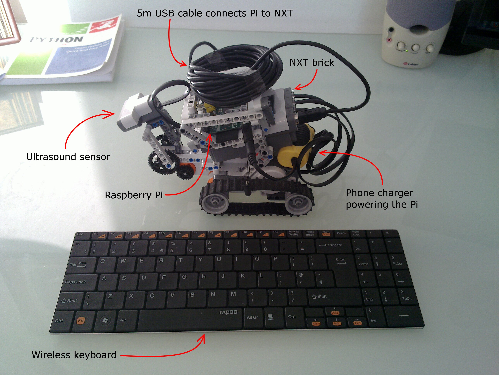

## Connected LEGO Robots

*by* Adam Cohen-Rose  
[@adamcohenrose](https://twitter.com/adamcohenrose)

*or*  

### Skynet baby steps…

## Introducing LEGO Mindstorms

*Plug and play robots*

Basic set contains 3 motors  
and sensors for:

* touch
* light/colour
* sound
* distance

## Program like LEGO...?

## Program like LEGO...?

Clunky

Odd icons & missing labels

Difficult to build complex programs

Based on LabVIEW!?

## Extend your Mind

### Additional sensors
* Compass
* GPS
* Accelerometer
----
#### But…
expensive, limited ports on block

## Extend your Mind

### Replace the IDE
* [LeJOS](http://www.lejos.org/): Java, Open Source
* [NXC](http://bricxcc.sourceforge.net/nbc/): Not eXactly C
* [RobotC](http://www.robotc.net/): Windows only, $49
----
#### But…
slow CPU, restricted memory

## Connect another brain

### Laptop via USB

* Scratch-like: [Enchanting](http://enchanting.robotclub.ab.ca/tiki-index.php) & [Snap-NXT](http://technoboy10.github.io/snap-nxt/)
* Python: [nxt-python](https://code.google.com/p/nxt-python)
* Node.js: [node-nxt](https://github.com/paulcuth/node-nxt) or [node-mindstorm-bt](https://github.com/davsebamse/node-mindstorm-bt)
----
Others available with varying levels of maturity

Bluetooth may work (but less likely on Macs)

## Connect *another* brain

### Android device via Bluetooth
Android phones & tablets have more power than the NXT

Write Android & NXT (LeJOS) code in Java

LEGO make a sample [MINDdroid app](https://github.com/NXT/LEGO-MINDSTORMS-MINDdroid)  
<small>(source available on github)</small>

----
Computer Vision using [OpenCV for Android](http://opencv.org/platforms/android.html)  
Speech Recognition in standard API (now offline in 4.2+)  
and various other sensor APIs

## More braaaiinnzz...

Raspberry Pi can use nxt-python over USB  
http://j.mp/pibot-nxt

## Connect **many** brains

### Control the robot from the network

Twitter-controlled robots

Facebook face-collecting robots

LEGO tanks vs nodecopters!

Real robots wandering in Minecraft worlds...

## Go play!

I am Adam Cohen-Rose  
[@adamcohenrose](https://twitter.com/adamcohenrose)

----
This presentation is available at  
